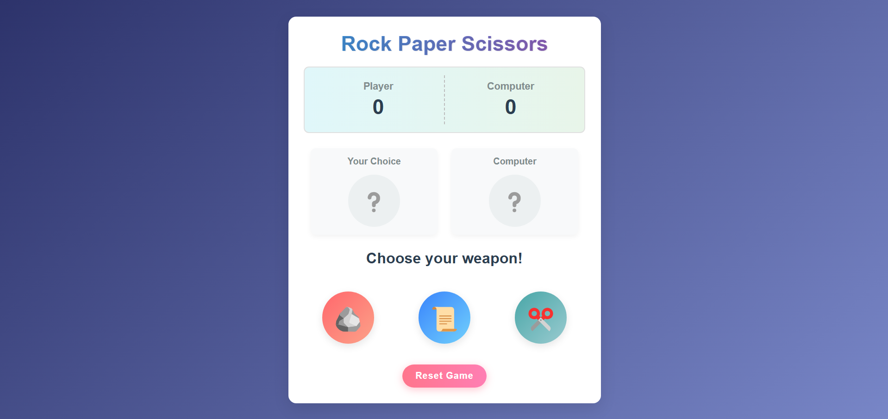

# Rock Paper Scissors Game

A simple and interactive Rock Paper Scissors game built with HTML, CSS, and JavaScript.

## Features

- Classic Rock Paper Scissors gameplay
- Visual countdown for computer's choice
- Score tracking for both player and computer
- Responsive design that works on different screen sizes
- Animated winner indication
- Reset game functionality

## How to Play

1. Click on one of the three buttons (Rock 🪨, Paper 📜, or Scissors ✂️) to make your choice
2. Watch the computer make its choice with a 3-second countdown
3. The winner is determined based on classic Rock Paper Scissors rules:
   - Rock beats Scissors
   - Scissors beat Paper
   - Paper beats Rock
4. The scores are updated automatically
5. Click "Reset Game" to start a new game with scores reset to zero

## Technologies Used

- HTML5
- CSS3 (with gradients and animations)
- JavaScript (ES6)

## Project Structure

rock-paper-scissors/
├── index.html # Main HTML file
├── style.css # CSS styles
└── script.js # JavaScript game logic

## Installation

No installation required! Just open the `index.html` file in your web browser.

## Customization

You can easily customize the game by modifying:

- Colors in the CSS file
- The emoji icons in the JavaScript `icons` object
- Animation timings in the JavaScript code

## Future Improvements

- Add localStorage to save high scores
- Implement multiplayer functionality
- Add more choices (Rock Paper Scissors Lizard Spock)
- Create different difficulty levels

## License

This project is open source and available under the [MIT License](LICENSE).
